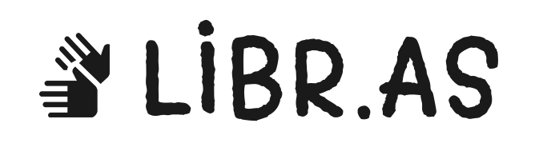

# <a href="http://viniciushedler.github.io/hackathon-1sti">Libr.as 👋</a> - *Hackathon 1sti*
  

Libr.as é um jogo de adivinhação de palavras onde você digita fazendo sinais em Libras, desenvolvido para o [1º Hackathon 1sti](https://1sti.com.br/) - FGV.  
Acesse o jogo por [aqui](http://viniciushedler.github.io/hackathon-1sti) ou leia mais a respeito abaixo.

*GRUPO:* ***KNN - K Nearest Nerds***  
***Membros:*** *Lf Laguardia, Bruno Fornaro, Vinicius Hedler, Marcelo Amaral*

## Problema: Difusão do Aprendizado de Libras

## Solução: Tornar o Aprendizado mais Interessante

## Descrição: Viabilidade de uso e aplicações
